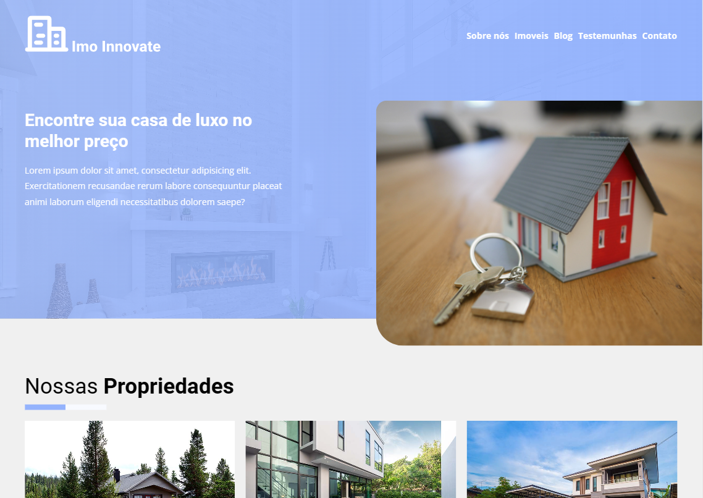

<h1 align="center">
ImoInnovate 🏢
</h1>



<h4 align="center"><a href="https://imoinnovate.netlify.app/">Clique para visitar o projeto</a></h4>

## 💬 - Sobre o projeto

#### O projeto ImoInnovate é uma plataforma imobiliária que foi desenvolvida com o objetivo de oferecer aos usuários uma experiência visual atraente e intuitiva. Ele foi construído usando tecnologias avançadas como HTML5, LESS, JavaScript, Gulp e Swiper. Durante o desenvolvimento, o foco principal foi dado ao design, garantindo que a aparência da plataforma fosse moderna e atraente. A lógica por trás da plataforma foi deixada de lado, mas futuramente estarei trabalhando para adicionar funcionalidades e melhorar a usabilidade da plataforma. O ImoInnovate é uma excelente opção para aqueles que estão procurando um imóvel e desejam uma experiência de navegação agradável e fácil de usar.

## ⚡ - Tecnologias utilizadas

- HTML5;
- Font-awesome;
- Less
- BEM;
- Gulp;
- Javascript;
- Swiper

## 🛠️ Instalação do Frontend

Clone este repositório usando o comando

```
git clone https://github.com/Lucassocorrosilva7/ImoInnovate.git
```

Entrar na pasta utilizando o comando:

```
cd ImoInnovate-main
```

Instale as dependências com o comando:

```
npm i
```

Para executar o gulp utilize o comando:

```
gulp dev
```

## 👤 Autor

#### Feito por Lucas Silva. Entre em contato! 👇

<a href="https://lucas-bio.netlify.app/"></a>
<a href="https://www.linkedin.com/in/luquinhasssilva/"></a>
<a href="mailto:someone@lucassocorrosilva@gmail.com"></a>
